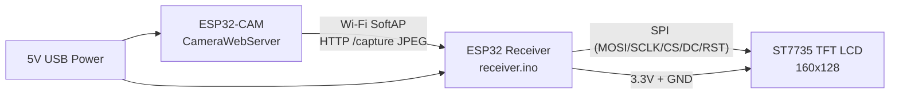
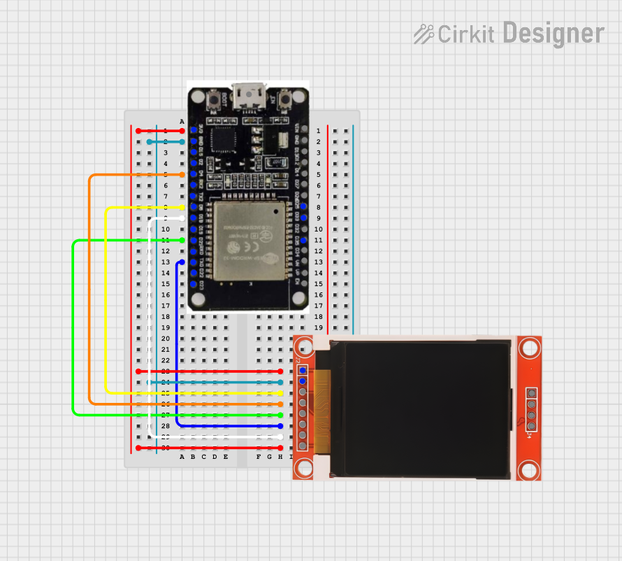
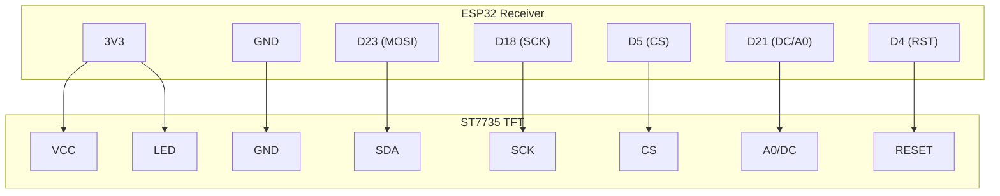

# ESP32-CAM to ST7735 LCD Student Guide

## 1) System Block Diagram

## 2) Parts List

| Qty | Part | Approx. Price |
|-----|------|--------------|
| 1x | ESP32 dev board (receiver) | $8 |
| 1x | ESP32-CAM (AI Thinker compatible) | $10 |
| 1x | ST7735 1.8in TFT SPI display (160x128) | $6 |
| 1x | Half-size breadboard | $5 |
| 1x | Jumper wire kit (male-male) | $4 |
| 2x | Micro-USB cables (receiver + camera) | $4 |
| 1x | Optional: external 5V USB power supply for camera | $8 |
| | **Total (approx.)** | **~$45** |

> **Note:** These are prototype prices for individual components purchased at retail. A finished production product would use integrated PCBs and bulk pricing, bringing the cost significantly lower.

## 3) Wiring Table (Confirmed)

This project uses the receiver pin definitions in [arduino-cam-lcd/receiver/receiver.ino](../receiver/receiver.ino).

| Breadboard Row | Screen Label | Wire Color | ESP32 Pin Location | Label on Board |
|---|---|---|---|---|
| Row 23 | VCC | 🔴 Red | Left side, Row 1 | 3V3 |
| Row 24 | GND | ⚫ Black | Left side, Row 2 | GND |
| Row 25 | CS | 🟡 Yellow | Left side, Row 8 | D5 |
| Row 26 | RESET | 🟠 Orange | Left side, Row 5 | D4 |
| Row 27 | A0 (DC) | 🟢 Green | Left side, Row 11 | D21 |
| Row 28 | SDA (MOSI) | 🔵 Blue | Left side, Row 15 | D23 |
| Row 29 | SCK | ⚪ White | Left side, Row 9 | D18 |
| Row 30 | LED | 🔴 Red | Left side, Row 1 | 3V3 |

### Important correction
- Screen A0/DC uses **D21**, located at **left side, Row 11** on the breadboard.
- D2 (Row 4) must not be used for A0/DC — it is a boot strapping pin and causes display issues at startup.

## 4) Wiring Diagram

## 5) Wiring Diagram (Logical)

If Mermaid preview fails in your editor, use the draw.io file:
- [arduino-cam-lcd/docs/wiring-diagram.drawio](wiring-diagram.drawio)
- Open in https://app.diagrams.net/

## 5) Software Roles

- Camera firmware: [CameraWebServer/CameraWebServer.ino](../../CameraWebServer/CameraWebServer.ino)
  - Hosts SoftAP: ESP32CAM-LINK
  - Serves JPEG at `/capture`
- Receiver firmware: [arduino-cam-lcd/receiver/receiver.ino](../receiver/receiver.ino)
  - Connects to camera AP
  - Fetches JPEG and draws to ST7735 over SPI

## 6) Student Build Steps

1. Wire receiver to TFT exactly as table above.
2. Flash camera firmware.
3. Flash receiver firmware.
4. Power both boards.
5. Confirm receiver joins camera AP and image appears on TFT.
6. If blank/unstable display, re-check A0/DC wire is on D21.
